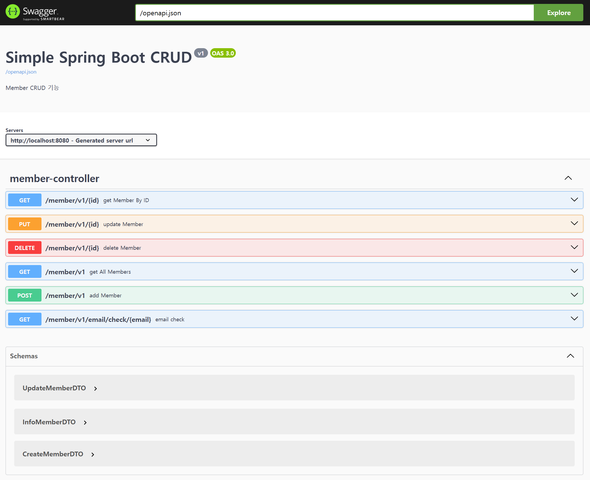

# Simple Spring Boot CRUD Example

## 📌 Features

- 240725 created, JDK 21, Spring Boot 3.3.2
    - PostgreSQL
    - Create an initial user
    - endpoints CRUD
        - member
    - API healthcheck
      - [Actuator](http://localhost:8080/actuator/health)
        - `http://localhost:8080/actuator/health`
    - Complete swagger Api info
        - [Swagger](http://localhost:8080/swagger)
            - `http://localhost:8080/swagger`
        - [OpenAPI](http://localhost:8080/openapi.json)
            - `http://localhost:8080/openapi.json`
    - TDD

 